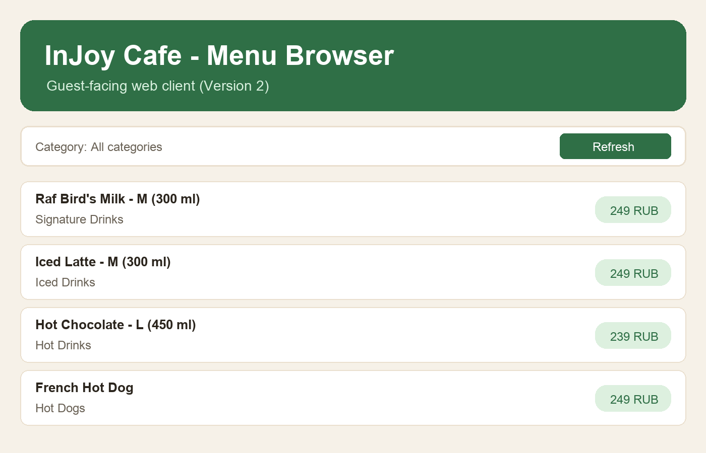

# InJoy Menu Bot

Telegram bot for InJoy cafe guests to browse menu items and for staff to manage menu content from chat.

## Demo

Add two current product screenshots before submission:

- `docs/screenshots/user-menu.png` - main user menu and category navigation.
- `docs/screenshots/admin-panel.png` - admin panel with menu management actions.




## Product context

### End users

- Cafe guests who use Telegram.
- Cafe staff and administrators.

### Problem that your product solves for end users

Guests need a fast mobile menu view instead of browsing static posts or files, and staff need a way to update menu data without manual database edits.

### Your solution

InJoy Menu Bot provides a button-based Telegram interface for guests and an in-chat admin panel for staff, backed by a FastAPI service with persistent SQLite storage.

## Features

### Implemented features

- User flow is button-based (inline keyboard), without command-heavy UX.
- Menu is rendered as readable image cards per category (mobile-friendly).
- Bot keeps one "live" panel message and edits it, so chat history stays clean.
- Staff admins can open `/admin` panel and manage dishes via buttons:
  - add
  - edit
  - delete
  - hide/show availability
  - hide/show all menu positions in one tap
  - delete all menu positions in one tap (with confirmation)
  - view all categories including unavailable positions
- Main admins can add/remove regular admins directly from bot.
- Backend API with persistent SQLite storage.
- Seeded menu data stored in `backend/data/injoy.db`.

### Not yet implemented features

- Order placement and payment flow from Telegram.
- Admin action history/audit log.
- Multi-language bot interface (for example RU/EN toggle).
- Web dashboard for non-Telegram menu management.

## Usage

### Guest flow

1. Open the bot in Telegram.
2. Run `/start`.
3. Choose menu categories using buttons.
4. Browse menu cards and switch categories as needed.

### Admin flow

1. Make sure your Telegram ID is listed in `BOT_SUPER_ADMIN_IDS` (or in `BOT_ADMIN_IDS` as fallback).
2. Open bot chat and run `/admin`.
3. Use buttons to add, edit, delete, or toggle availability for menu positions.
4. Use bulk actions to hide/show all or delete all positions (with confirmation).

## Deployment

### Which OS the VM should run on

- Ubuntu 24.04 LTS.

### What should be installed on the VM

- `git`
- Docker Engine with `docker` CLI
- Docker Compose plugin (`docker compose`)

### Step-by-step deployment instructions

1. Clone the repository and open project directory.
2. Create environment file:

```bash
cp .env.example .env
```

3. Set required values in `.env`:
   - `BOT_TOKEN`
   - `BACKEND_API_TOKEN`
   - `BOT_SUPER_ADMIN_IDS` (or `BOT_ADMIN_IDS` as fallback)
4. Build and run services:

```bash
docker compose up -d --build
```

5. Check backend health:

```bash
curl -sS http://localhost:8000/health
```

6. Open API docs in browser: `http://<VM_IP>:8000/docs`.
7. If you changed `.env`, recreate bot container:

```bash
docker compose up -d --force-recreate bot
```

## Project structure

- `backend/` - FastAPI app with menu CRUD.
- `bot/` - aiogram Telegram bot.
- `docker-compose.yml` - service orchestration for local/dev deployment.
